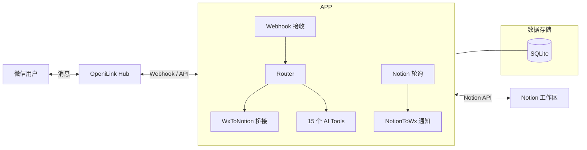

# @openilink/app-notion

微信 ↔ Notion 双向桥接 + 15 个 AI Tools。

## 特色

- **微信消息自动记录到 Notion 数据库** — 每位微信用户的消息自动归档到独立 Notion 页面
- **Notion 变更实时通知** — 当 Notion 页面被编辑时，自动推送通知给关联的微信用户
- **搜索 / 创建 / 查询页面和数据库** — 通过 AI 指令在微信中直接操作 Notion
- **评论管理** — 查看和添加 Notion 页面评论
- **待办管理** — 创建和管理 Notion 中的待办事项

## 架构



## 快速开始

### 1. 创建 Notion Integration

1. 访问 [Notion Integrations](https://www.notion.so/my-integrations)
2. 点击「+ New integration」
3. 填写名称（例如 `OpeniLink Bridge`），选择关联的工作区
4. 在「Capabilities」中勾选：Read content, Update content, Insert content, Read comments, Create comments
5. 点击「Submit」后复制 Internal Integration Secret（即 `NOTION_TOKEN`，以 `ntn_` 开头）

### 2. 共享数据库/页面给 Integration

1. 打开你想要桥接的 Notion 数据库或页面
2. 点击右上角「...」→「Add connections」→ 搜索并添加你创建的 Integration
3. 复制数据库 URL 中的 ID 作为 `NOTION_DATABASE_ID`（格式：`https://notion.so/{database_id}?v=...`）

### 3. 配置环境变量并启动

```bash
# 克隆项目
git clone https://github.com/openilink/app-notion.git
cd app-notion

# 安装依赖
npm install

# 配置环境变量
cp .env.example .env
# 编辑 .env 填写必要配置

# 开发模式
npm run dev

# 生产构建
npm run build
npm start
```

### Docker 部署

```bash
# 使用 docker-compose
docker-compose up -d
```

## 环境变量

| 变量名 | 必填 | 默认值 | 说明 |
|--------|------|--------|------|
| `HUB_URL` | 是 | — | OpeniLink Hub 服务地址 |
| `BASE_URL` | 是 | — | 本服务的公网回调地址（需能被 Hub 访问） |
| `NOTION_TOKEN` | 是 | — | Notion Internal Integration Token（`ntn_` 开头） |
| `NOTION_DATABASE_ID` | 否 | — | 默认写入的 Notion 数据库 ID（配置后启用变更轮询） |
| `DB_PATH` | 否 | `data/notion.db` | SQLite 数据库文件路径 |
| `PORT` | 否 | `8087` | HTTP 服务端口 |

## 使用方式

安装到 Bot 后，支持三种方式调用：

### 自然语言（推荐）

直接用微信跟 Bot 对话，Hub AI 会自动识别意图并调用对应功能：

- "在 Notion 里创建一个页面叫会议纪要"
- "搜一下 Notion 里关于产品规划的文档"

### 命令调用

也可以使用 `/命令名 参数` 的格式直接调用：

- `/create_page --database_id xxx --title 会议纪要`

### AI 自动调用

Hub AI 在多轮对话中会自动判断是否需要调用本 App 的功能，无需手动触发。

## 15 个 AI Tools

### 搜索（1 个）

| 工具名 | 说明 |
|--------|------|
| `search_notion` | 搜索 Notion 中的页面或数据库 |

### 页面（4 个）

| 工具名 | 说明 |
|--------|------|
| `create_page` | 在 Notion 数据库中创建新页面 |
| `get_page` | 获取 Notion 页面详情 |
| `update_page` | 更新 Notion 页面属性 |
| `read_page_content` | 读取 Notion 页面的正文内容 |

### 数据库（3 个）

| 工具名 | 说明 |
|--------|------|
| `query_database` | 查询 Notion 数据库中的条目 |
| `get_database_schema` | 获取 Notion 数据库的结构信息 |
| `create_database_item` | 在 Notion 数据库中创建新条目 |

### 块操作（3 个）

| 工具名 | 说明 |
|--------|------|
| `append_content` | 向 Notion 页面追加内容块 |
| `append_todo` | 向 Notion 页面添加待办事项 |
| `delete_block` | 删除 Notion 中的指定块 |

### 评论（2 个）

| 工具名 | 说明 |
|--------|------|
| `list_comments` | 查看 Notion 页面上的评论 |
| `create_comment` | 在 Notion 页面上创建评论 |

### 用户（2 个）

| 工具名 | 说明 |
|--------|------|
| `list_users` | 列出 Notion 工作区中的所有用户 |
| `get_me` | 获取当前 Notion 集成（机器人）的信息 |

## Notion Integration 配置指南

### 权限说明

创建 Integration 时，需要授予以下权限：

- **Read content** — 搜索、读取页面/数据库/块内容
- **Update content** — 更新页面属性、追加内容
- **Insert content** — 创建新页面、新数据库条目
- **Read comments** — 查看页面评论
- **Create comments** — 创建新评论

### 共享范围

Integration 只能访问明确共享给它的页面和数据库：

1. **数据库级别共享**：共享一个数据库后，Integration 可以访问其中所有页面
2. **页面级别共享**：单独共享的页面，Integration 可以读写该页面及其子页面
3. **工作区级别**：如果 Integration 类型为「Internal」，只能在创建它的工作区中使用

### Token 格式

- Internal Integration Token 以 `ntn_` 开头
- 请妥善保管，不要提交到代码仓库
- 如果 Token 泄露，可在 Integration 设置页面重新生成

## API 路由

| 方法 | 路径 | 说明 |
|------|------|------|
| `POST` | `/hub/webhook` | 接收 Hub 推送的事件 |
| `GET` | `/oauth/setup` | 启动 OAuth 安装流程 |
| `GET` | `/oauth/redirect` | OAuth 回调处理 |
| `GET` | `/manifest.json` | 返回应用清单（含工具定义） |
| `GET` | `/health` | 健康检查 |

## 安全与隐私

### 数据处理说明

- **消息内容不落盘**：本 App 在转发消息时，消息内容仅在内存中中转，**不会存储到数据库或磁盘**
- **仅保存消息 ID 映射**：数据库中只保存消息 ID 的对应关系（用于回复路由），不保存消息正文
- **用户数据严格隔离**：所有数据库查询均按 `installation_id` + `user_id` 双重过滤，不同用户之间完全隔离，无法互相访问

### 应用市场安装（托管模式）

通过 OpeniLink Hub 应用市场一键安装时，消息将通过我们的服务器中转。我们承诺：

- 不会记录、存储或分析用户的消息内容
- 不会将用户数据用于任何第三方用途
- 所有 App 代码完全开源，接受社区审查
- 我们会对每个上架的 App 进行严格的安全审查

### 自部署（推荐注重隐私的用户）

如果您对数据隐私有更高要求，建议自行部署本 App：

```bash
# Docker 部署
docker compose up -d

# 或源码运行
npm install && npm run build && npm start
```

自部署后所有数据仅在您自己的服务器上流转，不经过任何第三方。

## License

MIT
