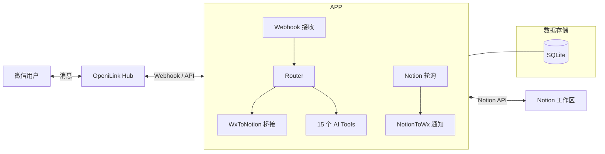

# @openilink/app-notion

[](https://github.com/openilink/openilink-hub)
[](LICENSE)
[]()

> 在微信里操作 Notion -- 搜索页面、创建文档、管理数据库、查看评论，还能把微信消息自动归档到 Notion。

**15 个 AI Tools** | 双向消息桥接 | 变更实时通知

---

## 亮点

- **微信消息 -> Notion 自动归档** -- 每位微信用户的消息自动写入独立 Notion 页面，聊天即笔记
- **Notion 变更 -> 微信推送** -- 页面被编辑时实时通知关联微信用户，团队协作零延迟
- **自然语言操作 Notion** -- 对 Bot 说「在 Notion 里搜一下产品规划」即可完成，无需记命令
- **完整 CRUD** -- 页面 / 数据库 / 块 / 评论 / 待办，覆盖日常 90% 操作

## 15 个 AI Tools 一览

| 分类 | 工具 | 说明 |
|------|------|------|
| **搜索** | `search_notion` | 搜索页面或数据库 |
| **页面** | `create_page` `get_page` `update_page` `read_page_content` | 创建 / 查看 / 更新 / 读取正文 |
| **数据库** | `query_database` `get_database_schema` `create_database_item` | 查询 / 获取结构 / 新建条目 |
| **块操作** | `append_content` `append_todo` `delete_block` | 追加内容 / 添加待办 / 删除块 |
| **评论** | `list_comments` `create_comment` | 查看 / 创建评论 |
| **用户** | `list_users` `get_me` | 列出工作区用户 / 获取机器人信息 |

## 使用方式

安装到 Bot 后，支持三种方式：

**自然语言（推荐）** -- 直接对 Bot 说话，Hub AI 自动识别意图并调用：
- "在 Notion 里创建一个页面叫会议纪要"
- "搜一下 Notion 里关于产品规划的文档"

**命令调用** -- `/create_page --database_id xxx --title 会议纪要`

**AI 自动调用** -- Hub AI 在多轮对话中自动判断何时需要调用本 App。

## 架构



<details>
<summary><strong>部署与配置</strong></summary>

### 1. 创建 Notion Integration

1. 访问 [Notion Integrations](https://www.notion.so/my-integrations)，点击「+ New integration」
2. 填写名称（如 `OpeniLink Bridge`），选择关联工作区
3. 在「Capabilities」中勾选：Read content, Update content, Insert content, Read comments, Create comments
4. 点击「Submit」后复制 Internal Integration Secret（即 `NOTION_TOKEN`，以 `ntn_` 开头）

### 2. 共享数据库/页面给 Integration

1. 打开目标 Notion 数据库或页面
2. 点击右上角「...」 -> 「Add connections」 -> 搜索并添加你的 Integration
3. 复制数据库 URL 中的 ID 作为 `NOTION_DATABASE_ID`（格式：`https://notion.so/{database_id}?v=...`）

### 3. 环境变量

| 变量名 | 必填 | 默认值 | 说明 |
|--------|------|--------|------|
| `HUB_URL` | 是 | -- | OpeniLink Hub 服务地址 |
| `BASE_URL` | 是 | -- | 本服务的公网回调地址（需能被 Hub 访问） |
| `NOTION_TOKEN` | 是 | -- | Notion Internal Integration Token（`ntn_` 开头） |
| `NOTION_DATABASE_ID` | 否 | -- | 默认写入的 Notion 数据库 ID（配置后启用变更轮询） |
| `DB_PATH` | 否 | `data/notion.db` | SQLite 数据库文件路径 |
| `PORT` | 否 | `8087` | HTTP 服务端口 |

### 4. 启动

```bash
# Docker（推荐）
docker compose up -d

# 或源码运行
git clone https://github.com/openilink/openilink-app-notion.git
cd openilink-app-notion
npm install
cp .env.example .env   # 编辑 .env 填写配置
npm run build && npm start
```

### API 路由

| 方法 | 路径 | 说明 |
|------|------|------|
| `POST` | `/hub/webhook` | 接收 Hub 推送的事件 |
| `GET` | `/oauth/setup` | 启动 OAuth 安装流程 |
| `GET` | `/oauth/redirect` | OAuth 回调处理 |
| `GET` | `/manifest.json` | 返回应用清单（含工具定义） |
| `GET` | `/health` | 健康检查 |

</details>

<details>
<summary><strong>Notion Integration 配置指南</strong></summary>

### 权限说明

创建 Integration 时，需要授予以下权限：

- **Read content** -- 搜索、读取页面/数据库/块内容
- **Update content** -- 更新页面属性、追加内容
- **Insert content** -- 创建新页面、新数据库条目
- **Read comments** -- 查看页面评论
- **Create comments** -- 创建新评论

### 共享范围

Integration 只能访问明确共享给它的页面和数据库：

1. **数据库级别共享**：共享一个数据库后，Integration 可以访问其中所有页面
2. **页面级别共享**：单独共享的页面，Integration 可以读写该页面及其子页面
3. **工作区级别**：如果 Integration 类型为「Internal」，只能在创建它的工作区中使用

### Token 格式

- Internal Integration Token 以 `ntn_` 开头
- 请妥善保管，不要提交到代码仓库
- 如果 Token 泄露，可在 Integration 设置页面重新生成

</details>

## 安全与隐私

- **消息内容不落盘** -- 消息仅在内存中中转，不存储到数据库或磁盘
- **仅保存消息 ID 映射** -- 数据库只保存消息 ID 对应关系（用于回复路由），不保存正文
- **用户数据严格隔离** -- 所有查询按 `installation_id` + `user_id` 双重过滤
- **完全开源** -- 所有代码接受社区审查；自部署后数据完全不经过第三方

## 更多 OpeniLink Hub App

| App | 说明 |
|-----|------|
| [openilink-hub](https://github.com/openilink/openilink-hub) | 开源微信 Bot 管理平台 |
| [app-github](https://github.com/openilink/openilink-app-github) | 微信管理 GitHub -- 36 Tools |
| [app-linear](https://github.com/openilink/openilink-app-linear) | 微信管理 Linear -- 13 Tools |
| [app-amap](https://github.com/openilink/openilink-app-amap) | 微信查高德地图 -- 10 Tools |
| [app-lark](https://github.com/openilink/openilink-app-lark) | 微信 <-> 飞书桥接 -- 34 Tools |
| [app-slack](https://github.com/openilink/openilink-app-slack) | 微信 <-> Slack 桥接 -- 23 Tools |
| [app-dingtalk](https://github.com/openilink/openilink-app-dingtalk) | 微信 <-> 钉钉桥接 -- 20 Tools |
| [app-discord](https://github.com/openilink/openilink-app-discord) | 微信 <-> Discord 桥接 -- 19 Tools |
| [app-google](https://github.com/openilink/openilink-app-google) | 微信操作 Google Workspace -- 18 Tools |

## License

MIT
